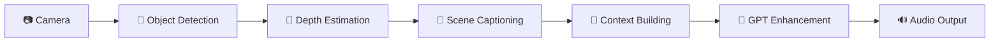

# 🎯 SpokenVision
### *AI-Powered Vision Assistant for the Visually Impaired*

<div align="center">

[](https://spokenvision.web.app/)
[](https://youtube.com/shorts/gWyHpFkxIAg?feature=share)
[](https://docs.google.com/presentation/d/1-q8HFq-ZHlbFR2NloiWQXmuxu3pfY8jJQWInpOJ0tsQ/edit?usp=sharing)

</div>

---

## 🌟 Overview

SpokenVision transforms the visual world into rich audio descriptions, empowering visually impaired users to navigate and understand their environment with confidence. Using cutting-edge AI technology, it provides real-time scene analysis and natural language descriptions through an intuitive web interface.

<div align="center">
  <a href="https://youtube.com/shorts/gWyHpFkxIAg?feature=share">
    
  </a>
  <p><em>Click to watch the demo video</em></p>
</div>

---

## ✨ Key Features

<table>
<tr>
<td width="50%">

### 🔍 **Computer Vision**
- **Real-time Object Detection** using YOLOv8
- **Depth Estimation** with MiDaS neural networks
- **Scene Understanding** through BLIP/Qwen captioning
- **Semantic Segmentation** for spatial awareness

</td>
<td width="50%">

### 🗣️ **Natural Language**
- **GPT Integration** for human-like descriptions
- **Context Building** with spatial relationships
- **High-Quality TTS** using Kokoro/gTTS
- **Accessibility Optimized** for screen readers

</td>
</tr>
</table>

---

## 🏗️ Architecture

<div align="center">
  
  <p><em>End-to-end AI processing pipeline</em></p>
</div>

### 🔄 **Processing Pipeline**



1. **Camera Feed** → Real-time video capture
2. **Object Detection** → YOLOv8 identifies objects and people
3. **Depth Analysis** → MiDaS estimates spatial relationships
4. **Scene Description** → BLIP generates natural captions
5. **Context Building** → Spatial awareness and object tracking
6. **Language Enhancement** → GPT converts technical output to conversational descriptions
7. **Audio Synthesis** → High-quality text-to-speech output

---

## 🚀 Quick Start

### 📋 **Prerequisites**

<div align="center">

| Requirement | Version | Purpose |
|------------|---------|---------|
| 🐍 **Python** | 3.8+ | Backend processing |
| 🟢 **Node.js** | 16+ | Frontend tooling (optional) |
| 🎵 **FFmpeg** | Latest | Audio processing |
| 🖥️ **GPU** | Recommended | Model acceleration |

</div>

### ⚡ **Installation**

```bash
# Clone the repository
git clone https://github.com/Mesa112/SpokenVision.git
cd SpokenVision

# Install Python dependencies
pip install -r requirements.txt
```

### 🖥️ **Frontend Setup**

```bash
# Navigate to frontend directory
cd FrontEnd/public

# Start local server
python -m http.server 8000
```

### 🧠 **Backend Setup**

```bash
# Navigate to backend directory
cd Backend

# Start the API server
uvicorn cloud_server:app --host 0.0.0.0 --port 5000
```

### 🔗 **Configuration**

Update the API endpoint in your frontend files:

**`FrontEnd/public/script.js`** and **`FrontEnd/public/model-loader.js`**:
```javascript
const API_ENDPOINT = "http://localhost:5000/process/";
```

### 🌐 **Access the Application**

Open your browser and navigate to: **`http://localhost:8000/index.html`**

---

## 📁 Project Structure

<details>
<summary>Click to expand file overview</summary>

| File | Purpose |
|------|---------|
| 🎯 `main.py` | Main application orchestrator |
| 🔍 `object_detection.py` | YOLOv8 object detection pipeline |
| 📏 `depth_estimation.py` | MiDaS depth estimation |
| 📝 `blip_image_captioning.py` | BLIP scene captioning |
| 🗣️ `kokoro_audio.py` | Text-to-speech synthesis |
| 🧠 `context_builder.py` | Spatial context processing |
| 🌐 `cloud_server.py` | FastAPI backend server |
| 🎨 `index.html` | Main web interface |
| ⚙️ `script.js` | Frontend interaction logic |
| 🔧 `Dockerfile` | Container configuration |
| 📦 `requirements.txt` | Python dependencies |

</details>

---

## 💡 Technology Stack

<div align="center">

### **AI & Machine Learning**


### **Backend**


### **Frontend**


### **Cloud & Deployment**


</div>

---

## 🎯 Use Cases

<div align="center">
<table>
<tr>
<td align="center" width="33%">
<h3>🚶‍♂️ Navigation</h3>
<p>Real-time obstacle detection and spatial awareness for safe movement</p>
</td>
<td align="center" width="33%">
<h3>📖 Scene Understanding</h3>
<p>Comprehensive descriptions of environments, objects, and people</p>
</td>
<td align="center" width="33%">
<h3>🏠 Daily Activities</h3>
<p>Assistance with reading labels, identifying objects, and understanding surroundings</p>
</td>
</tr>
</table>
</div>

---

## 🤝 Contributing

We welcome contributions! Please see our [Contributing Guidelines](CONTRIBUTING.md) for details.

---

## 🙏 Acknowledgments

- **Salesforce BLIP** for image captioning
- **Ultralytics YOLOv8** for object detection  
- **Intel MiDaS** for depth estimation
- **Kokoro TTS** for natural speech synthesis
- **OpenAI GPT** for language enhancement

---

<div align="center">

### 🌟 Star this repository if SpokenVision helped you!

**Made with ❤️ for accessibility and inclusion**

[🌐 Live Demo](https://spokenvision.web.app/) • [📺 Watch Demo](https://youtube.com/shorts/gWyHpFkxIAg?feature=share) • [📊 Presentation](https://docs.google.com/presentation/d/1-q8HFq-ZHlbFR2NloiWQXmuxu3pfY8jJQWInpOJ0tsQ/edit?usp=sharing)

</div>
