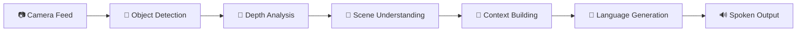

# 🎯 SpokenVision
### *Proof of Concept: AI-Powered Vision Assistant for the Visually Impaired*

<div align="center">

[](https://spokenvision.web.app/)
[](https://youtube.com/shorts/gWyHpFkxIAg?feature=share)
[](https://docs.google.com/presentation/d/1-q8HFq-ZHlbFR2NloiWQXmuxu3pfY8jJQWInpOJ0tsQ/edit?usp=sharing)

</div>

---

## 🌟 Vision & Purpose

**SpokenVision** is a proof-of-concept application that demonstrates the transformative potential of AI-powered assistive technology for visually impaired individuals. This project showcases how advanced computer vision models, when combined with high-performance computing resources, can create real-time spoken descriptions of the visual world.

### 💡 **The Big Picture**
While this web-based demo operates with certain limitations, it represents a glimpse into the future of accessibility technology. Imagine this system running on:
- **High-end edge computing devices** with dedicated GPU acceleration
- **Real-time processing systems** with millisecond response times  
- **Specialized hardware** designed for continuous operation
- **Advanced AI models** trained specifically for accessibility applications

<div align="center">
  <a href="https://youtube.com/shorts/gWyHpFkxIAg?feature=share">
    
  </a>
  <p><em>Click to watch the proof-of-concept demo</em></p>
</div>

---

## 🎯 Real-World Vision

### **Current Implementation: Web Demo**
- Browser-based interface demonstrating core concepts
- Cloud-hosted AI models with reasonable response times
- Proof that multiple AI systems can work together effectively

### **Future Potential: Production Systems**
- **Wearable devices** with integrated cameras and bone-conduction audio
- **Smartphone apps** leveraging on-device neural processing units
- **Smart glasses** with real-time object detection and spatial audio
- **IoT integration** with smart home and navigation systems

---

## ✨ Demonstrated Capabilities

<table>
<tr>
<td width="50%">

### 🔍 **Computer Vision Pipeline**
- **Object Detection** - Identifies people, vehicles, obstacles
- **Depth Estimation** - Understands spatial relationships  
- **Scene Captioning** - Generates contextual descriptions
- **Semantic Segmentation** - Maps different areas and surfaces

</td>
<td width="50%">

### 🗣️ **Natural Communication**
- **Context Building** - Tracks objects over time
- **Spatial Awareness** - "Person approaching from your left"
- **Natural Language** - Human-like descriptions via GPT
- **Audio Synthesis** - Clear, responsive text-to-speech

</td>
</tr>
</table>

---

## 🏗️ Technical Architecture

<div align="center">
  
  <p><em>Multi-model AI pipeline processing visual information into spoken guidance</em></p>
</div>

### 🔄 **Processing Pipeline**



**Real-time Processing Flow:**
1. **Visual Input** → Continuous camera feed analysis
2. **Object Recognition** → YOLOv8 identifies relevant objects and people
3. **Spatial Understanding** → MiDaS creates depth maps for navigation
4. **Scene Interpretation** → BLIP generates natural scene descriptions
5. **Contextual Awareness** → System tracks changes and relationships
6. **Natural Communication** → GPT converts technical data to conversational guidance
7. **Audio Feedback** → High-quality speech synthesis delivers information

---

## 🚀 Impact & Applications

### 🌍 **Transformative Potential**

<div align="center">
<table>
<tr>
<td align="center" width="33%">
<h3>🚶‍♂️ Independent Navigation</h3>
<p><strong>"There's a step down in 3 feet, handrail on your right"</strong><br/>
Real-time obstacle detection and path guidance for safe, confident movement</p>
</td>
<td align="center" width="33%">
<h3>📖 Environmental Awareness</h3>
<p><strong>"Busy restaurant, waiter approaching your table"</strong><br/>
Rich contextual descriptions of surroundings, people, and social situations</p>
</td>
<td align="center" width="33%">
<h3>🏠 Daily Independence</h3>
<p><strong>"Milk carton on middle shelf, expiration date visible"</strong><br/>
Assistance with reading, shopping, and everyday tasks</p>
</td>
</tr>
</table>
</div>

### 🔬 **Technical Innovations Demonstrated**

- **Multi-model Integration** - Combining 5+ AI models in real-time
- **Contextual Memory** - Tracking objects and changes over time  
- **Natural Language Processing** - Converting technical data to human speech
- **Edge Computing Ready** - Architecture designed for mobile deployment
- **Accessibility First** - Built specifically for assistive technology use cases

---

## 💻 Try the Demo

> **Note:** This web demo showcases the concept with intentional limitations. A production system would run on dedicated hardware with GPU acceleration for true real-time performance.

### **Quick Start (Local Development)**

```bash
# Clone and setup
git clone https://github.com/Mesa112/SpokenVision.git
cd SpokenVision && pip install -r requirements.txt

# Frontend (demo interface)
cd FrontEnd/public && python -m http.server 8000

# Backend (AI processing)
cd Backend && uvicorn cloud_server:app --host 0.0.0.0 --port 5000
```

### **Live Demo Access**
Visit **[spokenvision.web.app](https://spokenvision.web.app)** to try the web-based proof of concept.

---

## 🛠️ Technical Implementation

<details>
<summary><strong>🔧 Core Technologies & Architecture</strong></summary>

### **AI Models & Processing**
- **YOLOv8** - Real-time object detection and tracking
- **MiDaS/DPT** - Monocular depth estimation for spatial awareness  
- **BLIP/Qwen** - Image captioning and scene understanding
- **Segformer** - Semantic segmentation for surface/area mapping
- **Kokoro TTS** - High-quality neural text-to-speech synthesis
- **GPT Integration** - Natural language enhancement and context building

### **Infrastructure & Deployment**
- **FastAPI** - High-performance Python web framework
- **Google Cloud Run** - Scalable serverless container deployment
- **Firebase Hosting** - Global CDN for frontend delivery
- **Docker** - Containerized deployment with model optimization
- **WebRTC** - Real-time media streaming for camera access

### **Performance Optimizations**
- **Lazy Model Loading** - On-demand initialization to reduce memory usage
- **Concurrent Processing** - Parallel execution of AI models
- **Context Caching** - Intelligent tracking to avoid redundant processing
- **Progressive Enhancement** - Graceful degradation for different devices

</details>

---

## 🌟 Future Roadmap

### **Near-term Enhancements**
- [ ] **Offline Processing** - Edge deployment for privacy and speed
- [ ] **Mobile Applications** - Native iOS/Android apps with camera integration
- [ ] **Voice Commands** - Interactive dialogue for specific queries
- [ ] **Customizable Descriptions** - User preferences for detail level and focus

### **Long-term Vision**  
- [ ] **Wearable Integration** - Smart glasses and haptic feedback devices
- [ ] **Multi-modal Input** - Integration with GPS, accelerometers, and other sensors
- [ ] **Community Features** - Crowdsourced accessibility information
- [ ] **Personal AI Assistant** - Learning individual preferences and needs

---

## 💡 Technical Contribution

This project demonstrates several important concepts for AI accessibility:

1. **Practical Multi-Model Integration** - Shows how different AI systems can work together
2. **Real-time Processing Architecture** - Proves feasibility of responsive assistive technology  
3. **Natural Language Interface** - Converts technical AI outputs to human-friendly communication
4. **Scalable Cloud Infrastructure** - Architecture that can handle multiple users efficiently
5. **Accessibility-First Design** - Purpose-built for assistive technology applications

### **Research & Development Value**
SpokenVision serves as a foundation for researchers, developers, and organizations working on:
- Assistive technology applications
- Multi-modal AI system integration  
- Real-time computer vision processing
- Accessibility-focused user interface design
- Edge computing for AI applications

---

## 🤝 Impact & Collaboration

**This project represents more than code—it's a step toward digital inclusion.** By demonstrating the potential of AI-powered assistive technology, SpokenVision aims to inspire:

- **Technology companies** to prioritize accessibility in their AI research
- **Researchers** to explore practical applications of computer vision
- **Developers** to consider how their skills can create meaningful social impact
- **Organizations** to invest in inclusive technology development

---

## 🙏 Acknowledgments & Technologies

**Core AI Models:**
- [Salesforce BLIP](https://github.com/salesforce/BLIP) - Image captioning and visual understanding
- [Ultralytics YOLOv8](https://github.com/ultralytics/ultralytics) - Real-time object detection
- [Intel MiDaS](https://github.com/isl-org/MiDaS) - Monocular depth estimation  
- [Kokoro TTS](https://github.com/kokoro-agi/kokoro) - Neural text-to-speech synthesis
- [OpenAI GPT](https://openai.com/) - Natural language processing and enhancement

**Infrastructure & Frameworks:**
- Google Cloud Platform, Firebase, FastAPI, Docker, and the open-source AI community

---

<div align="center">

### 🌟 **Building the Future of Accessible Technology**

**Every line of code is a step toward independence for millions of visually impaired individuals worldwide.**

[🌐 Try Demo](https://spokenvision.web.app/) • [📺 Watch Vision](https://youtube.com/shorts/gWyHpFkxIAg?feature=share) • [📊 Technical Overview](https://docs.google.com/presentation/d/1-q8HFq-ZHlbFR2NloiWQXmuxu3pfY8jJQWInpOJ0tsQ/edit?usp=sharing)

</div>
